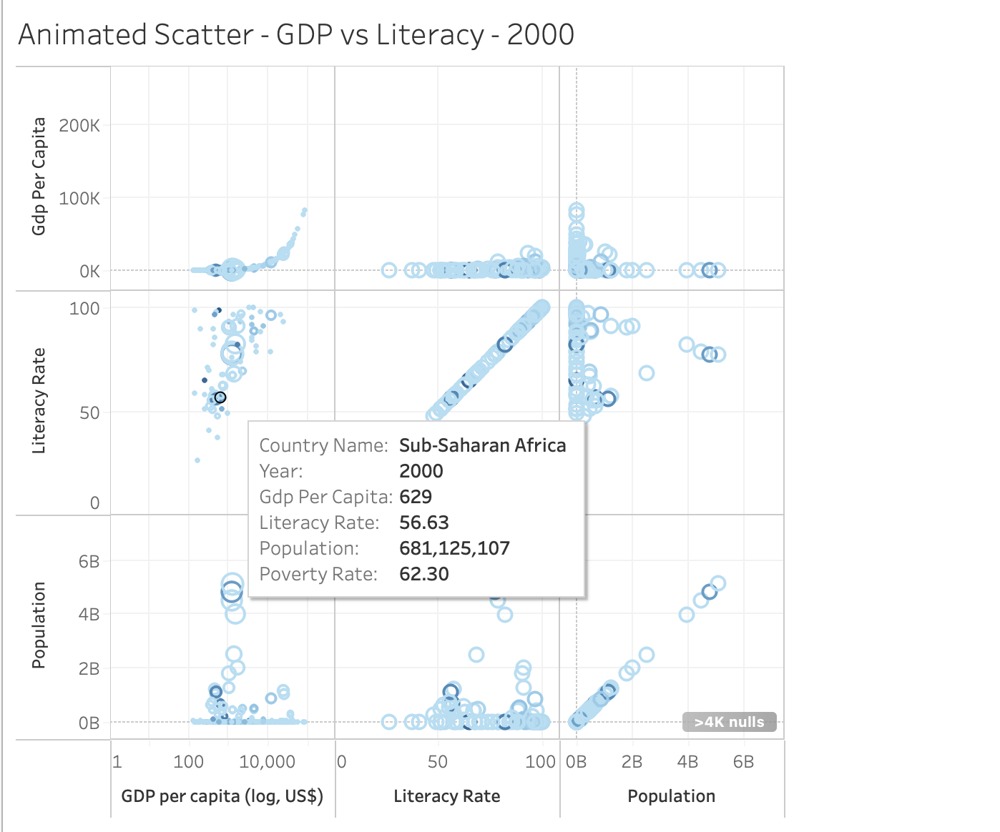
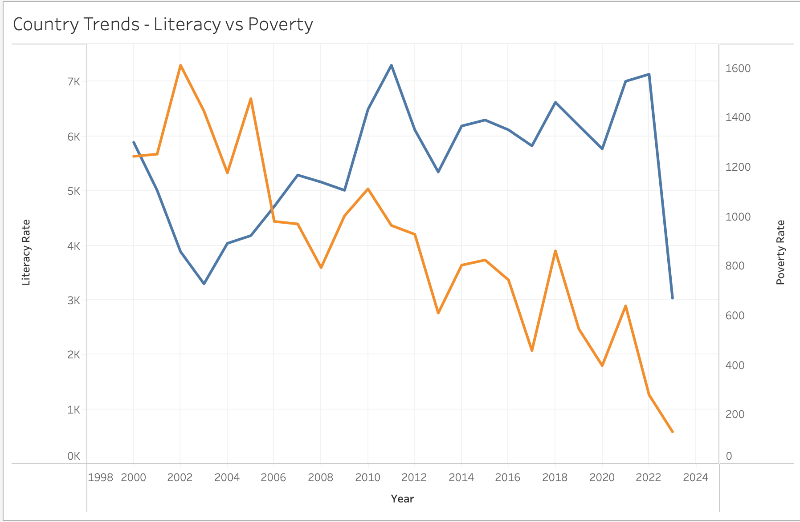
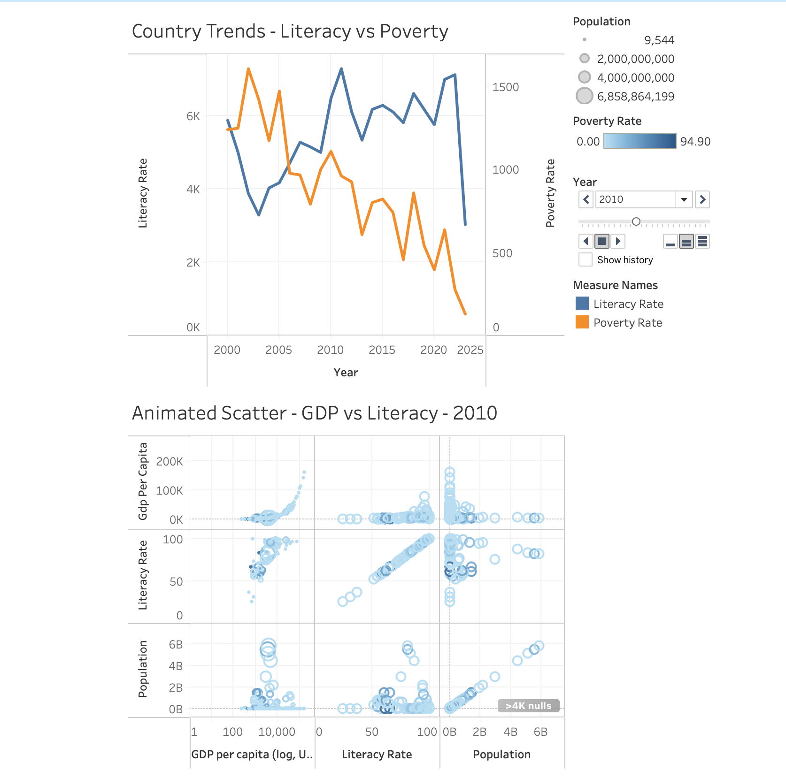
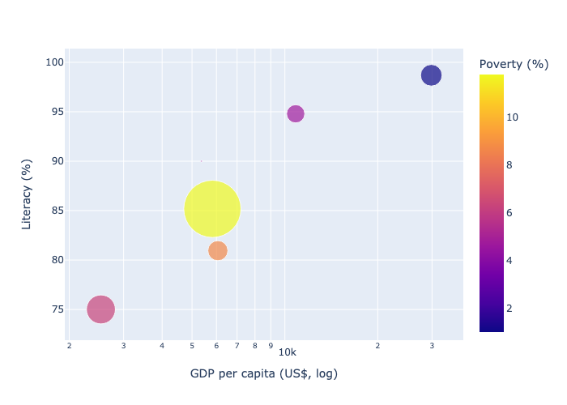

# GDP-vs-Poverty-Literacy-Analysis

This project analyzes the relationship between **GDP per capita**, **poverty rates**, and **literacy rates** for countries worldwide.  
It uses a cleaned & merged dataset and visualizes key patterns using **Tableau** and Python's Plotly.

## Tableau Dashboard
**Interactive Dashboard:** [View on Tableau Public] https://public.tableau.com/app/profile/mehal.gosalia1215/viz/Book1_17546794366960/Dashboard1?publish=yes

Click to explore — filter by country, compare GDP vs literacy, and see trends over time.

## Datasets
This project combines three datasets from **The World Bank Open Data**:

1. **GDP per capita (current US$)**  
   - **Source:** [World Bank – GDP per capita](https://data.worldbank.org/indicator/NY.GDP.PCAP.CD)  
   - **Description:** Annual GDP per capita in current US dollars for each country.  
   - **Filtering:**  
     - Kept data from **2000 onwards** to ensure recent relevance.  
     - Removed regions/aggregates like "World" or "Low income" to focus only on individual countries.  

2. **Poverty headcount ratio (% of population)**  
   - **Source:** [World Bank – Poverty headcount ratio at $2.15/day](https://data.worldbank.org/indicator/SI.POV.DDAY)  
   - **Description:** Percentage of the population living below the international poverty line (in 2017 PPP).  
   - **Filtering:**  
     - Kept the most recent available year for each country to avoid duplicates.  
     - Removed entries with missing values in both GDP and literacy datasets.  

3. **Adult literacy rate (% ages 15 and older)**  
   - **Source:** [World Bank – Literacy rate, adult total](https://data.worldbank.org/indicator/SE.ADT.LITR.ZS)  
   - **Description:** Percentage of people aged 15 and above who can read and write a short, simple statement about their everyday life.  
   - **Filtering:**  
     - Kept only the latest reported year per country.  
     - Removed rows where literacy rate was missing and could not be imputed.  

    ###  Data Merging & Processing
    - Merged datasets on **Country Name** and **Country Code** using Pandas.  
    - Standardized country names to avoid mismatches.  
    - Kept only countries that appeared in **all three datasets**.  
    - Saved the final cleaned dataset as `data/processed/panel.csv` for both Tableau and Jupyter Notebook analysis.

## Data Visualization & Insights

This project uses **two key visualization tools** — **Tableau** and **Plotly (via Jupyter Notebook)** — to explore and present insights from GDP, literacy rate, and poverty rate data.

---

### 1. Tableau Dashboard

The Tableau dashboard provides a **clear, interactive analysis** of the relationship between **GDP per capita**, **literacy rate**, and **poverty rate** for countries worldwide.

#### Key Insights
- **GDP vs Literacy:** Higher GDP per capita generally correlates with higher literacy rates.
- **Poverty Distribution:** Color coding highlights poverty rates — darker tones indicate higher poverty levels.
- **Population Impact:** Bubble size reflects population, making it easy to spot high-population countries.
- **Outliers:** Quickly identify countries with unusual combinations (e.g., high GDP but lower literacy).

#### Dashboard Layout
1. **Scatter Plot** —  
   - **X-axis:** GDP per capita (log scale for better spread)  
   - **Y-axis:** Literacy rate (%)  
   - **Color:** Poverty rate (%)  
   - **Size:** Population  

2. **Filters** —  
   - **Year filter** to analyze specific years  
   - **Region filter** to compare across regions  

3. **Summary Cards** —  
   - Display average GDP, literacy rate, and poverty rate for the selected view

#### Examples ~

*This Tableau scatter plot for the year 2000 shows the relationship between GDP per capita, literacy rate, and population size, highlighting that Sub-Saharan Africa had low GDP ($629), low literacy (56.63%), high poverty (62.3%), and a large population (~681M).*

*This dual-axis line chart shows the inverse relationship between literacy rate and poverty rate over time — with literacy (blue line) generally increasing while poverty (orange line) declines, highlighting socioeconomic progress.*

**1. Country Trends – Literacy vs Poverty**

*Dual-axis line chart showing changes in literacy rate (blue) and poverty rate (orange) over time.*

***Purpose**: Highlights the correlation between rising literacy rates and declining poverty.*

***Insight**: Most countries show increasing literacy and decreasing poverty, but the pace varies by region.*

**2. Animated Scatter – GDP vs Literacy**

*Bubble chart comparing GDP per capita (log scale) to literacy rate, with bubble size = population and color = poverty rate.*

***Purpose**: Reveals how countries are positioned economically and socially in different years.*

***Insight**: High-GDP countries generally have high literacy and low poverty and some outliers exist with high GDP but still low literacy or high poverty.*

---

### 2. Jupyter Notebook — Plotly Bubble Chart

To complement the Tableau dashboard, a **Plotly bubble chart** was created in Python for a more **code-driven, reproducible analysis**.

#### Chart Details
- **X-axis:** GDP per capita (log scale)  
- **Y-axis:** Literacy rate (%)  
- **Color:** Poverty rate (%) — gradient shows variation in poverty levels  
- **Size:** Population — larger circles for larger populations  
- **Interactivity:** Hover tooltips display exact values for each country

#### Insights from the Bubble Chart
- Strong positive correlation between GDP per capita and literacy rate in most countries.
- Countries with very high poverty rates tend to cluster in the lower GDP range.
- A few high-GDP countries still have noticeable poverty rates.
- Visual differences in bubble sizes highlight the varying population impacts.

#### Chart Preview

---

### Why Use Both?
- **Tableau** provides a **user-friendly, interactive dashboard** perfect for presentations and quick exploration.
- **Plotly in Jupyter** offers a **code-based, customizable approach**, allowing integration into data pipelines and reproducible research.

## Final Insights
From the combined analysis of GDP per capita, literacy rate, and poverty rate:

**1. Strong correlation between literacy and economic prosperity**
- Countries with higher literacy rates generally have higher GDP per capita and lower poverty rates.
- The Jupyter bubble plot clearly visualizes this trend, with wealthier nations clustered at high literacy and low poverty.

**2. Poverty reduction aligns with literacy improvement**
- Tableau’s Country Trends – Literacy vs Poverty shows an inverse relationship over time: as literacy increases, poverty tends to decrease.

**3. Regional disparities remain**
- In Animated Scatter – GDP vs Literacy, regions such as Sub-Saharan Africa remain in lower GDP and literacy brackets despite gradual improvements.

**4. Population size adds complexity**
- Some highly populated countries maintain high literacy but still struggle with moderate poverty rates, suggesting that economic growth is unevenly distributed.

**5. Outliers and anomalies**
- A few countries have relatively high GDP but still low literacy rates, indicating that economic growth alone does not guarantee educational advancement.

## Project Structure
    GDP-VS-Poverty-Literacy/
    │
    ├── assets/                         # Saved images from analysis
    │   └── hero.png
    │
    ├── dashboards/                     # Tableau dashboards
    │   └── GDP vs Poverty-Literacy Dashboard.twb
    │
    ├── data/
    │   ├── processed/                   # Cleaned and combined datasets
    │   │   ├── insights_summary.csv
    │   │   └── panel.csv
    │   │
    │   └── raw/                         # Original datasets
    │       ├── gdp_per_capita.csv
    │       ├── literacy_rate.csv
    │       ├── population.csv
    │       └── poverty_rate.csv
    │
    ├── notebooks/                       # Jupyter notebooks
    │   └── analysis.ipynb
    │
    ├── src/                             # Data processing scripts
    │   └── merge_datasets.py
    │
    ├── .gitignore                       # Files and folders to ignore in Git
    ├── README.md                        # Project documentation
    └── images/                          # Screenshots for README
        ├── image.png
        ├── image-1.png
        └── image-2.png

## Tools & Technologies

- **Python**: Pandas, Plotly, Jupyter Notebooks
- **Tableau**: Interactive dashboard & data visualization